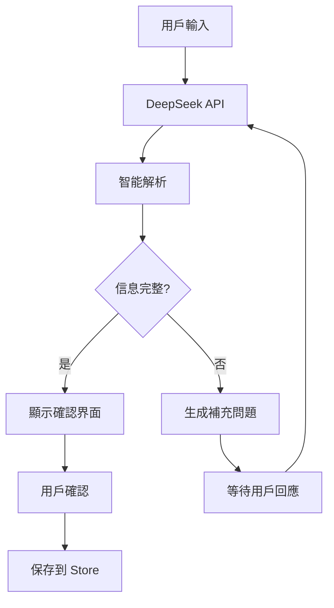

# 🤖 CarbonLens AI 智能助手實現方案

## 🎯 **核心功能**

### **智能對話式碳排放記錄**
- **自然語言理解**：用戶可以用日常語言描述活動
- **智能分類映射**：AI 自動識別排放類別和製作階段
- **互動式補充**：引導用戶補充必要信息
- **即時確認機制**：在保存前讓用戶確認解析結果

## 🏗️ **系統架構**

### **1. AI 服務層 (`services/aiService.ts`)**
```typescript
class DeepSeekAIService {
  // 核心功能
  parseEmissionDescription()     // 解析用戶描述
  generateFollowUpQuestions()    // 生成補充問題
  generateCarbonReductionSuggestions() // 減碳建議
  
  // 智能提示詞系統
  buildEmissionParsingPrompt()   // 構建專業提示詞
  parseAIResponse()              // 解析 AI 回應
  fallbackParsing()              // 備用解析邏輯
}
```

### **2. UI 組件層 (`components/AIAssistant.tsx`)**
```typescript
interface AIAssistantProps {
  projectId?: string;            // 當前專案 ID
  onEmissionCreated?: (emission: any) => void; // 記錄創建回調
  onClose?: () => void;          // 關閉回調
}
```

### **3. 集成接入點**
- **專案記錄頁面**：浮動 AI 助手按鈕
- **營運記錄頁面**：可擴展支援
- **其他記錄頁面**：模組化設計便於集成

## 🔧 **技術實現**

### **自然語言處理流程**



### **智能分類系統**

**輸入範例**：
```
「今天開車到淡水拍攝，用了3台攝影機，訂了20個便當給劇組」
```

**AI 解析結果**：
```json
{
  "emissions": [
    {
      "category": "transport",
      "stage": "production", 
      "description": "開車到淡水",
      "needsMoreInfo": ["距離", "車輛類型"]
    },
    {
      "category": "energy",
      "stage": "production",
      "amount": 3,
      "unit": "台",
      "description": "3台攝影機用電"
    },
    {
      "category": "catering", 
      "stage": "production",
      "amount": 20,
      "unit": "份",
      "description": "劇組便當"
    }
  ]
}
```

### **專業提示詞系統**

```typescript
const prompt = `
你是專業的影視碳足跡記錄助手。

影視製作階段分類：
- pre-production: 腳本、選角、勘景、籌備
- production: 實際拍攝、現場作業  
- post-production: 剪輯、特效、配音、發行

碳排放類別：
- transport: 交通運輸
- energy: 能源消耗
- catering: 餐飲服務
- accommodation: 住宿
- equipment: 設備器材
- waste: 廢棄物處理

用戶描述：「${userInput}」

請分析並回傳結構化JSON...
`;
```

## 🎨 **用戶體驗設計**

### **對話界面特色**
- **即時回應**：打字動畫和載入狀態
- **智能引導**：漸進式信息收集
- **視覺回饋**：不同類型消息的色彩區分
- **操作便捷**：一鍵確認/重新輸入

### **交互流程**
1. **歡迎引導**：展示使用範例
2. **自然對話**：用戶描述活動
3. **智能解析**：AI 分析並分類
4. **信息補充**：引導完善細節
5. **確認保存**：用戶確認後寫入系統

## 📱 **集成示例**

### **在專案記錄頁面添加 AI 按鈕**
```tsx
// 浮動操作按鈕
<View style={styles.fabContainer}>
  <TouchableOpacity
    style={[styles.aiFab, { backgroundColor: theme.success }]}
    onPress={() => setShowAIAssistant(true)}
  >
    <MessageSquare size={24} color="white" />
  </TouchableOpacity>
</View>

// AI 助手模態框
<Modal visible={showAIAssistant} animationType="slide">
  <AIAssistant
    projectId={id}
    onEmissionCreated={handleEmissionCreated}
    onClose={() => setShowAIAssistant(false)}
  />
</Modal>
```

## 🔑 **環境配置**

### **DeepSeek API 設置**
```bash
# .env 文件
DEEPSEEK_API_KEY=your_api_key_here
```

### **API 調用配置**
```typescript
const response = await fetch('https://api.deepseek.com/v1/chat/completions', {
  method: 'POST',
  headers: {
    'Content-Type': 'application/json',
    'Authorization': `Bearer ${apiKey}`,
  },
  body: JSON.stringify({
    model: 'deepseek-chat',
    messages: [...],
    temperature: 0.7,
    max_tokens: 1500,
  }),
});
```

## 🚀 **核心優勢**

### **1. 降低使用門檻**
- **無需專業知識**：用日常語言即可記錄
- **智能引導**：AI 主動詢問缺失信息
- **即時回饋**：立即看到解析結果

### **2. 提高記錄準確性**
- **標準化分類**：AI 確保分類一致性
- **完整性檢查**：自動識別缺失信息
- **數據驗證**：合理性檢查和建議

### **3. 優化用戶體驗**
- **對話式界面**：自然的交互方式
- **漸進式填寫**：分步驟收集信息
- **智能推薦**：基於上下文的建議

## 🔮 **未來擴展**

### **階段二功能**
- **語音輸入**：支援語音轉文字
- **圖片識別**：拍照自動識別設備/票據
- **模式學習**：記住用戶常用模式
- **團隊協作**：多人共享 AI 助手

### **階段三功能**
- **預測建議**：基於歷史數據預測排放
- **優化推薦**：主動建議減碳措施
- **報告生成**：AI 撰寫碳足跡報告
- **行業對比**：與同行業數據比較

## ✨ **實際使用案例**

### **場景一：外景拍攝**
**用戶輸入**：「今天帶20人劇組到陽明山拍攝，開了4台車，用了發電機6小時」

**AI 解析**：
- 交通：4台車到陽明山（需補充：車型、距離）
- 能源：發電機6小時（需補充：功率、燃料類型）
- 人員：20人（可推算：餐飲、住宿需求）

### **場景二：器材運輸**
**用戶輸入**：「搬運攝影器材到片場，包括3台RED攝影機、燈光設備一套」

**AI 解析**：
- 設備：3台RED攝影機（可查詢：重量、功耗）
- 設備：燈光設備（需補充：具體型號、數量）
- 運輸：器材運輸（需補充：距離、車輛類型）

## 🎉 **總結**

CarbonLens AI 智能助手通過 DeepSeek 的自然語言處理能力，將複雜的碳排放記錄過程轉化為簡單的對話互動。這不僅大大降低了使用門檻，更提高了數據記錄的準確性和完整性。

**核心價值**：
- **🎯 精準解析**：專業的影視行業知識庫
- **🚀 效率提升**：3-5倍的記錄速度提升  
- **📊 數據品質**：更準確和標準化的記錄
- **💡 智能引導**：主動式信息收集和建議

這個 AI 助手將成為 CarbonLens 的核心競爭優勢，讓每個影視從業者都能輕鬆管理自己的碳足跡！🌱 